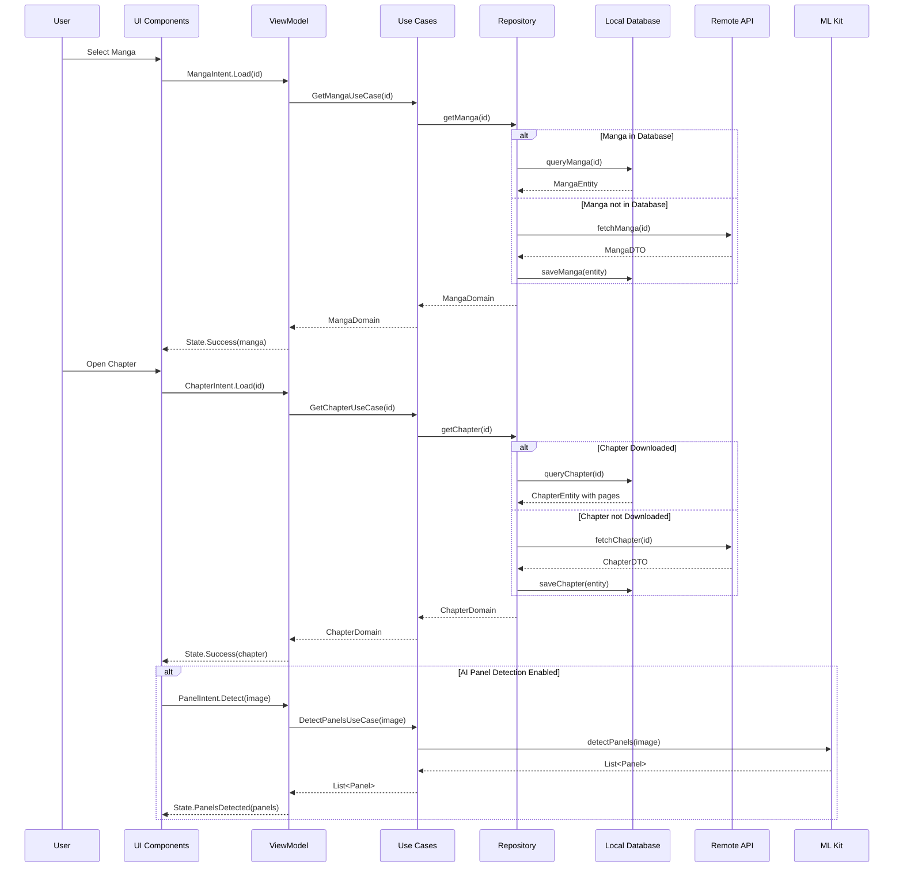
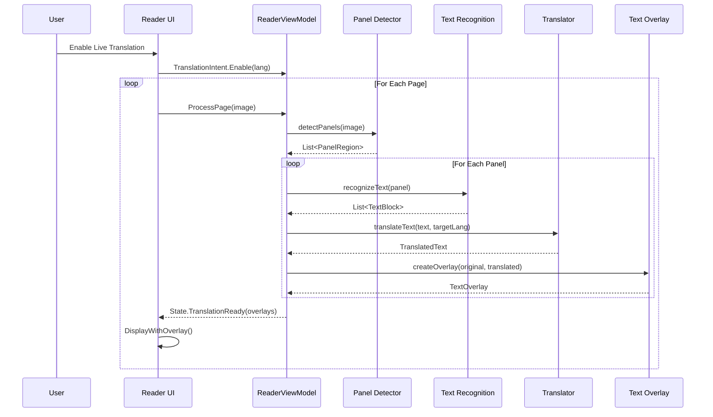

# MangaVerse Architecture Diagrams

## Clean Architecture Overview

```mermaid
graph TD
    subgraph Presentation Layer
        UI[UI Components]--→|Events|VM[ViewModels]
        VM--→|States|UI
    end
    
    subgraph Domain Layer
        VM--→|Invoke|UC[Use Cases]
        UC--→|Return|VM
        UC--→|Call|RI[Repository Interfaces]
        RI--→|Return|UC
        E[Entities/Models]--→|Used by|UC
    end
    
    subgraph Data Layer
        RI--→|Implemented by|RI_IMPL[Repository Implementations]
        RI_IMPL--→|Return|RI
        RI_IMPL--→|Use|DS[Data Sources]
        DS--→|Return|RI_IMPL
        DS--→|Map to|E
    end
    
    subgraph External
        DS--→|Access|API[Remote API]
        DS--→|Access|DB[Local Database]
        DS--→|Access|FS[File System]
        DS--→|Access|PREF[Preferences]
    end
```

## MVI Pattern Flow

```mermaid
flowchart LR
    UI[UI Layer]--→|User Intent|VM[ViewModel]
    VM--→|Action|UC[Use Cases]
    UC--→|Result|VM
    VM--→|State Update|STATE[State Holder]
    STATE--→|New State|UI
```

## Data Flow Diagram

```mermaid
flowchart TD
    UI[UI Layer]--→|Request Data|VM[ViewModel]
    VM--→|Invoke|UC[Use Cases]
    UC--→|Call|REPO[Repository]
    
    REPO--→|Check|CACHE{Cache Valid?}
    CACHE--→|Yes|DB[Local Database]
    CACHE--→|No|API[Remote API]
    
    API--→|Fetch Data|REPO
    REPO--→|Store|DB
    DB--→|Return Data|REPO
    
    REPO--→|Return|UC
    UC--→|Process|VM
    VM--→|Update State|UI
```

## Module Dependencies

```mermaid
graph TD
    APP[App Module]--→|Depends on|FEAT[Feature Modules]
    APP--→|Depends on|CORE[Core Module]
    FEAT--→|Depends on|CORE
    
    subgraph Feature Modules
        BROWSE[Browse Feature]
        READER[Reader Feature]
        DOWNLOAD[Download Feature]
        SETTINGS[Settings Feature]
        CLUBS[Reading Clubs Feature]
        SYNC[Sync Feature]
        AI[AI Features]
    end
    
    subgraph Core Module
        COMMON[Common]
        NETWORK[Network]
        DATABASE[Database]
        DOMAIN[Domain]
        SECURITY[Security]
        ANALYTICS[Analytics]
    end
```

## Component Interaction - Manga Reading Flow



## Security Architecture

```mermaid
graph TD
    subgraph User Authentication
        AUTH[Authentication]--→|Secure|TOKEN[Token Management]
        TOKEN--→|Validate|API_ACCESS[API Access]
    end
    
    subgraph Data Security
        DOWNLOAD[Download Manager]--→|Store|ENC[Encryption Layer]
        ENC--→|Write|SEC_DB[SQLCipher Database]
        ENC--→|Write|SEC_FS[Encrypted File Storage]
    end
    
    subgraph Access Control
        APP_LOCK[App Lock]--→|Protect|APP_ACCESS[App Access]
        BIO[Biometric Auth]--→|Unlock|SEC_DB
        BIO--→|Unlock|SEC_FS
    end
```

## Offline Capability Flow

```mermaid
flowchart TD
    START[User Initiates Download]--→|Queue|DM[Download Manager]
    DM--→|Process|WORKER[WorkManager Worker]
    
    WORKER--→|Fetch|API[MangaDex API]
    API--→|Return|WORKER
    
    WORKER--→|Encrypt|ENC[Encryption Service]
    ENC--→|Store Images|FS[File System]
    ENC--→|Store Metadata|DB[SQLCipher DB]
    
    subgraph Offline Access
        READ[Read Request]--→|Check|AVAIL{Available Offline?}
        AVAIL--→|Yes|DECRYPT[Decrypt Content]
        AVAIL--→|No|ONLINE[Fetch Online]
        DECRYPT--→|Display|UI[UI Layer]
        ONLINE--→|Display|UI
    end
```

## AI Translation Flow



## Sync Service Architecture

```mermaid
graph TD
    subgraph MangaVerse App
        SYNC_MANAGER[Sync Manager]--→|Coordinate|MAL_SYNC[MAL Sync Service]
        SYNC_MANAGER--→|Coordinate|ANILIST_SYNC[AniList Sync Service]
        
        READER[Reader]--→|Progress Update|SYNC_MANAGER
        LIBRARY[Library]--→|Status Update|SYNC_MANAGER
    end
    
    subgraph External Services
        MAL_SYNC--→|OAuth|MAL_API[MyAnimeList API]
        ANILIST_SYNC--→|OAuth|ANILIST_API[AniList API]
    end
    
    subgraph Sync Storage
        SYNC_MANAGER--→|Store|SYNC_DB[Sync Database]
        SYNC_DB--→|Provide|SYNC_MANAGER
    end
    
    subgraph Background Processing
        SYNC_WORKER[Sync Worker]--→|Process Queue|SYNC_DB
        SYNC_WORKER--→|Send Updates|MAL_SYNC
        SYNC_WORKER--→|Send Updates|ANILIST_SYNC
    end
```

## Reading Clubs Feature

```mermaid
graph TD
    subgraph Club Features
        CLUBS[Clubs Manager]--→|Manage|DISCUSSIONS[Discussions]
        CLUBS--→|Manage|RECOMMENDATIONS[Recommendations]
        CLUBS--→|Manage|READING_SESSIONS[Reading Sessions]
        CLUBS--→|Manage|NOTIFICATIONS[Notifications]
    end
    
    subgraph Backend Integration
        CLUBS--→|Connect|FIREBASE[Firebase]
        FIREBASE--→|Store|FIRESTORE[Firestore]
        FIREBASE--→|Messaging|FCM[Firebase Cloud Messaging]
        FIREBASE--→|Auth|AUTH[Firebase Auth]
    end
    
    subgraph User Interactions
        USER[User]--→|Join/Create|CLUBS
        USER--→|Participate|DISCUSSIONS
        USER--→|Share|RECOMMENDATIONS
        USER--→|Join|READING_SESSIONS
    end
```